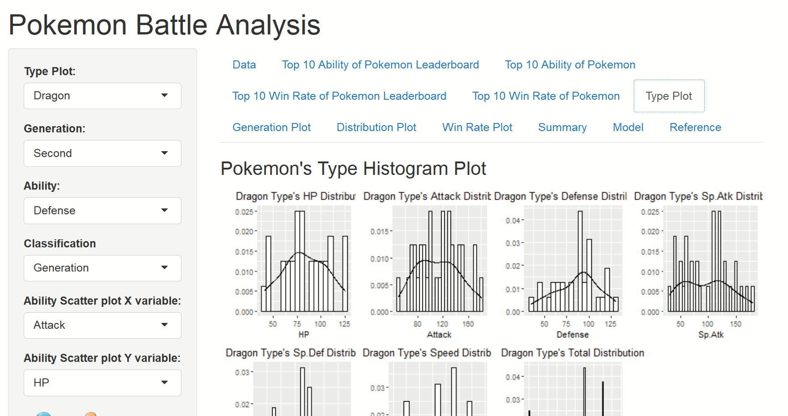
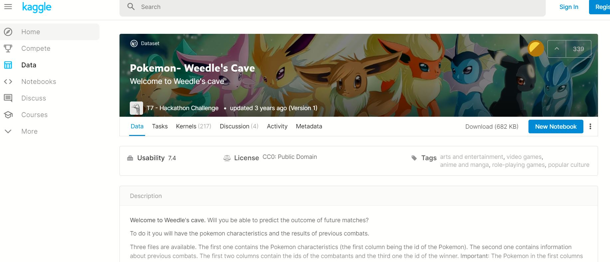

# Pokemon Battle Analysis

### Groups
* 林冠宇, 108352028
* 黃子瑋, 108352024
* 蔡政融, 108356023

### Goal
Our goal is to predict the result of the Pokémon battle !

### Demo 
You should provide an example commend to reproduce your result
```R
Rscript code/modelselection.R --fold 5  --pokemon data/pokemon.csv --combat data/combats.csv --report results/logistic.csv  --methods logistic
Rscript code/modelselection.R --fold 5  --pokemon data/pokemon.csv --combat data/combats.csv --report results/logistic.csv  --methods randomforest
Rscript code/modelselection.R --fold 5  --pokemon data/pokemon.csv --combat data/combats.csv --report results/logistic.csv  --methods xgboost

```
### Shiny.io

* We put our EDA & Model result into shiny app

  ShinyApps link: [https://ziweihuang.shinyapps.io/FinalProject/]



## Folder organization and its related information

### docs
* Our presentation, 1082_datascience_FP_group5.pdf


### data

* Data we use is the data set on the kaggle website called "Pokemon- Weedle's Cave"

  [Pokemon Battle](https://www.kaggle.com/terminus7/pokemon-challenge)
  


* The data set contains twelve variables:
  
  Variable |  Definition | Key
  ---------|-------------|----------
  Number   |Code name of Pokemon| 1 to 800
  Name     |Name of Pokemon|
  Type 1   |1st attack type|
  Type 2   |2nd attack type|
  HP       |Hitpoints|
  Attack   |Attack force|
  Defense  |Defense points|
  Sp.Atk   |Special attack force|
  SP.Def   |Special defense points|
  Speed    |Speed of pokemon|
  Generation|Development stage| 1 to 6
  Legendary|Legendary status|1=legendary, 0=ordinary
  
  


  * And the data below is the result of the battle, we will divide the data into train and test to train the model
  
  
  
  * Note : The Pokemon in the first columns attacks first.

* Any preprocessing?
  * Handle missing data : In our data set, three Pokemon's name are missing and we use the number and other information(e.g attack, defence ...) to find out the correct Pokemon's name on the official website. Besides, there is a Pokemon that is divided into male and female and has a gender symbol next to the name label, which causes an error when reading the data set. We also fixed this problem manually.

### code

* Which method do you use?
  * We build logistic/randomforest/xgboost three model and use cross-validation method to train our model.
  
* What is a null model for comparison?
  * We use logistic model as our null model.
  
* How do your perform evaluation? ie. Cross-validation, or extra separated data
  * We use cross-validation and extra separated data to perform evaluation.
  
### results

* Which metric do you use 
  * We use confusion matrix to visualize our prediction and it contain precision, recall, sensitivity, specificity, F1 score and accuray. Besides, we also use ROC curve and compute AUC to perform our prediction.

* Is your improvement significant?
  * Our improvement is significant. We can see the model performance result on shiny and the accuracy of randomforest/xgboost model is greater than the accuracy of logistic model.
  
* What is the challenge part of your project?
  * It is quite challenging to complete a project from start to finish. From discussion, assignment, solving possible problems, and finally reporting on the stage, everyone needs to work together, except for the unfamiliar with this type of report, We need to absorb and understand class content and put it into practice at the same time. This process is very challenging.

## Reference
* Data Source
  * Pokemon- Weedle's Cave [https://www.kaggle.com/terminus7/pokemon-challenge]

* Domain Konwledge
  * The Official Pokemon Website [https://www.pokemon.com/uk/]
  * Pokemon Wikipedia [https://wiki.52poke.com/wiki/%E4%B8%BB%E9%A1%B5]

* Exploratory Data Analysis
  * Pokemon Battles | Kaggle [https://www.kaggle.com/jonathanbouchet/pokemon-battles]
  * Data ScienceTutorial for Beginners | Kaggle [https://www.kaggle.com/kanncaa1/data-sciencetutorial-for-beginners]
  * Pokemon's Types and Features Exploratory Data Analysis | Zhihu [https://zhuanlan.zhihu.com/p/26787563]

* Packages you use
  * The packages we use for "shiny.io": shiny、tidyverse、fmsb、corrplot、ggpubr、WVPlots、ggExtra、gridExtra
  * The packages we use for "training": ggplot2、rpart、randomForest、xgboost、dplyr、plyr、party、argparser、pROC、DiagrammeR、gridExtra、lattice、caret、e1071


