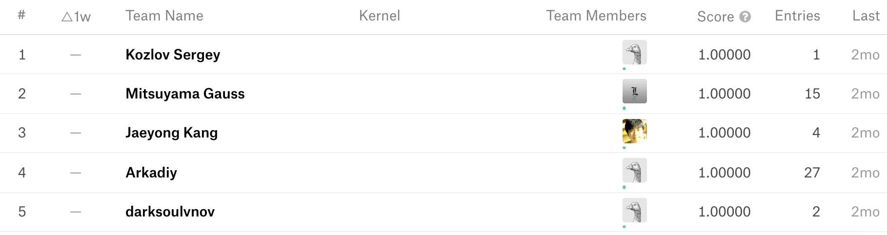

# hw5

## Titanic: Machine Learning from Disaster

Start here! Predict survival on the Titanic and get familiar with Machine Learning basics

[Kaggle Titanic](https://www.kaggle.com/c/titanic)

## Steps

1. perform *n*-fold cross-validation on the training data under three-way split to select the best prediction model
2. report the average accuracy of cross-validation (training, validation, testing in *n*-fold cross-validation), i.e., hw4
3. then apply the selected model on the test data
4. output prediction result

```R
Rscript hw5_studentID.R --fold n --train Titanic_Data/train.csv --test Titanic_Data/test.csv --report performance.csv --predict predict.csv
```

5. Submit your prediction to Kaggle system under display name: [yourname]_1072DS@NCCU
6. Make a snapshot of your score on Leaderboard and update in your README.md



## Score

* 6 testing parameters from fold 5 to fold 10

```R
Rscript hw5_9999.R --fold 5 --train Titanic_Data/train.csv --test Titanic_Data/test.csv --report performance1.csv --predict predict.csv
...
Rscript hw5_9999.R --fold 10 --train Titanic_Data/train.csv --test Titanic_Data/test.csv --report performance6.csv --predict predict.csv
```
Each testing parameters get 15 points.
**Please do not set input/output in your local path or URL.** 
Otherwise, your code will fail due to fixed path problem.

Penalty: without training, calibration, testing answer (-5 points of each answer)

## Bonus
* Round number to two decimal places: 2 points
* Performance Bonus: average testing performance
  * 0.90 ~ : 4 points
  * 0.85 ~ 0.90: 3 points
  * 0.80 ~ 0.85: 2 points
  * 0.75 ~ 0.80: 1 points
* Average testing performance is closed to the score of Kaggle (<= 0.05): 4 points
